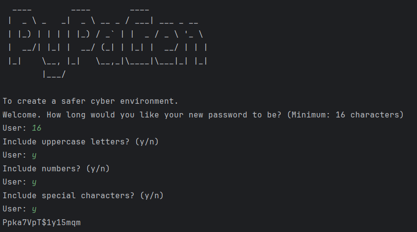

```
 ____         ____         ____
|  _ \ _   _|  _ \ __ _ / ___| ___ _ __
| |_) | | | | |_) / _` | |  _ / _ \ '_ \
| __/| |_| | __/ (_| | |_| | __/ | | |
|_|   \__, |_|   \__,_|\____|\___|_| |_|
      |___/
```

PyPaGen is a Python-based password generator for creating strong, random, and secure passwords.

-----

### About PyPaGen

PyPaGen is designed with a focus on generating robust passwords, taking into account recommendations often found in security guidelines like **NIS2**.

Key features and design choices:

  * **Password Length:** Passwords are capped at **16 characters**, exceeding the minimum recommendations of standards like NIS2.

  * **Character Sets:** Users can choose to include **numbers, uppercase letters, and symbols**. The generator ensures a truly random distribution of these character types, rather than allowing users to specify the exact count of each. This approach aims to enhance the randomness and unpredictability of the generated passwords.

  * **Randomness Algorithm:** The core of PyPaGen uses a unique, random mathematical solution to create password patterns, aiming for genuine randomness in each output. If you're not satisfied with a generated password, simply try again\!

  * **Title Design:** The ASCII art for the title was created using [this generator](https://budavariam.github.io/asciiart-text/).



This project was developed as a first step in exploring secure coding practices.
