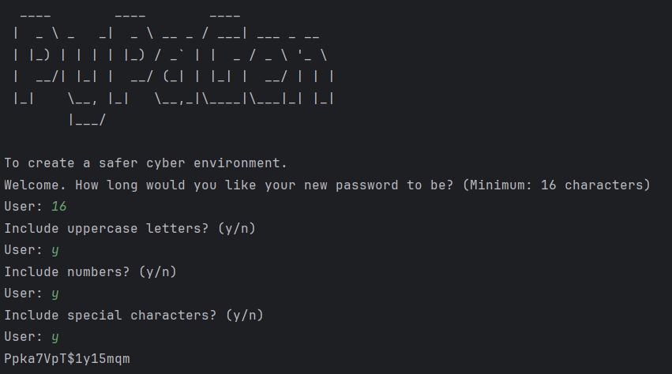

```
  ____        ____        ____            
 |  _ \ _   _|  _ \ __ _ / ___| ___ _ __  
 | |_) | | | | |_) / _` | |  _ / _ \ '_ \ 
 |  __/| |_| |  __/ (_| | |_| |  __/ | | |
 |_|    \__, |_|   \__,_|\____|\___|_| |_|
        |___/                             
```

PyPaGen is a Python-based password generator for creating strong, random, and secure passwords.

-----

### About PyPaGen

PyPaGen is designed with a focus on generating robust passwords, taking into account recommendations often found in security guidelines like **NIS2**.

My main goal for PyPaGen was randomness. I wanted to create the most random passwords possible, without any recognizable patterns. To achieve this, I intentionally removed the option for users to explicitly set the exact count of numbers, uppercase letters, or special characters. Instead, I aimed for a truly random distribution.
Here's a snippet of the core logic I used to distribute character types:
```Python
def get_length(user_input, name_count):
    random_num = random.randint(0, user_input - 1)
    try:
        result = user_input // random_num
    except ZeroDivisionError:
        return 1
    return name_count + result
```
This function takes the desired password length and uses a division by a random number (always one less than the password length) to determine the count of certain character types. To guarantee that at least one of each chosen character type is always included, I implemented a try-except block to catch ZeroDivisionErrors.
Then, based on these calculated counts, I used a simple function to add random characters from their respective pools:
def get_random(name_count, character):
```Python
    for i in range(1, name_count + 1):
        random_chars = random.choice(character)
        password_list.append(random_chars)
```
Finally, to truly mix everything up and ensure the most random password I could create, I used random.shuffle on the final list of characters.
This project was a fantastic first step in exploring secure coding practices.

Key features and design choices:

  * **Password Length:** Passwords are capped at **16 characters**, exceeding the minimum recommendations of standards like NIS2.

  * **Character Sets:** Users can choose to include **numbers, uppercase letters, and symbols**. The generator ensures a truly random distribution of these character types, rather than allowing users to specify the exact count of each. This approach aims to enhance the randomness and unpredictability of the generated passwords.

  * **Randomness Algorithm:** The core of PyPaGen uses a unique, random mathematical solution to create password patterns, aiming for genuine randomness in each output. If you're not satisfied with a generated password, simply try again\!

  * **Title Design:** The ASCII art for the title was created using [this generator](https://budavariam.github.io/asciiart-text/).



This project was developed as a first step in exploring secure coding practices.
